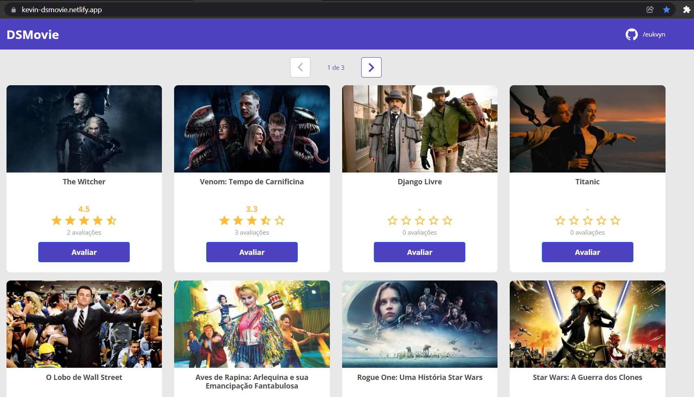

# DSMovie 

Link do projeto: https://kevin-dsmovie.netlify.app/
 
Obs: A aplicação precisa de cerca de 30 segundos para entrar em contato com o backend que está hospedado no heroku.

DSMovie é uma aplicação full stack web construída durante a 1ª edição da **Semana Spring React**, evento organizado pela [DevSuperior](https://devsuperior.com "Site da DevSuperior"). A aplicação consiste em uma avaliação de filmes, onde o usário interage com a paginação dos filmes listados, e escolhe um para avaliar. Informa o seu email e uma nota que vai de 1 até 5.

## Layout web

***

# Tecnologias utilizadas
## Back end
- Java
- Spring Boot
- JPA 
## Front end
- HTML / CSS / JS / TypeScript
- ReactJS
## Implantação em produção
- Back end: Heroku
- Front end web: Netlify
- Banco de dados: Postgresql

# Autor

Feito por: Kevin Almeida | [<a href="https://www.linkedin.com/in/kevin-almeida-desenvolvedor/">Veja meu Linkedin</a>]
 
Créditos: DevSuperior | [<a href="https://www.youtube.com/c/DevSuperior">Veja o canal do youtube da DevSuperior</a>]